# DevSecOps Spring Boot API Documentation 🚀

## Overview 📋

This document provides comprehensive documentation for the DevSecOps Spring Boot RESTful API. The application is built with security-first principles, implementing robust validation, monitoring, and documentation features.

## Application Architecture 🏗️

### Technology Stack
- **Framework**: Spring Boot 2.7.18 (LTS)
- **Java Version**: Java 11
- **Security**: Spring Security with custom configuration
- **Validation**: JSR-303 Bean Validation
- **Documentation**: OpenAPI 3 with Swagger UI
- **Monitoring**: Spring Boot Actuator
- **Testing**: JUnit 5, Spring Boot Test

### Package Structure
```
com.example.demo/
├── DemoApplication.java          # Main Spring Boot application
├── controller/
│   └── DemoController.java       # REST API endpoints
└── config/
    └── SecurityConfig.java       # Security configuration
```

## API Architecture Diagram

```mermaid
graph TB
    subgraph "Client Layer"
        Client[👤 Client Applications]
        Browser[🌐 Web Browser]
        Tools[🔧 API Testing Tools]
    end
    
    subgraph "Load Balancer"
        LB[⚖️ Load Balancer/Reverse Proxy]
    end
    
    subgraph "Spring Boot Application"
        subgraph "Security Layer"
            SF[🔒 Security Filter Chain]
            Auth[🔐 Authentication]
            Authz[🛡️ Authorization]
        end
        
        subgraph "Web Layer"
            DC[🎮 DemoController]
            VH[✅ Validation Handler]
            EH[❌ Exception Handler]
        end
        
        subgraph "Service Layer"
            LS[📝 Logging Service]
            MS[📊 Monitoring Service]
        end
        
        subgraph "Configuration"
            SC[⚙️ SecurityConfig]
            AC[🔧 Application Config]
        end
    end
    
    subgraph "External Services"
        Swagger[📚 Swagger UI]
        Actuator[⚕️ Spring Actuator]
        Metrics[📈 Metrics Endpoint]
    end
    
    Client --> LB
    Browser --> LB
    Tools --> LB
    LB --> SF
    
    SF --> Auth
    Auth --> Authz
    Authz --> DC
    
    DC --> VH
    VH --> EH
    DC --> LS
    DC --> MS
    
    SC --> SF
    AC --> DC
    
    DC --> Swagger
    MS --> Actuator
    MS --> Metrics
    
    classDef client fill:#e3f2fd,stroke:#1976d2,stroke-width:2px
    classDef security fill:#fff3e0,stroke:#f57400,stroke-width:2px
    classDef controller fill:#e8f5e8,stroke:#388e3c,stroke-width:2px
    classDef service fill:#fce4ec,stroke:#c2185b,stroke-width:2px
    classDef config fill:#f3e5f5,stroke:#7b1fa2,stroke-width:2px
    classDef external fill:#f5f5f5,stroke:#424242,stroke-width:2px
    
    class Client,Browser,Tools client
    class SF,Auth,Authz security
    class DC,VH,EH controller
    class LS,MS service
    class SC,AC config
    class Swagger,Actuator,Metrics external
```



## Request-Response Flow Diagram

```mermaid
sequenceDiagram
    participant C as 👤 Client
    participant LB as ⚖️ Load Balancer
    participant SF as 🔒 Security Filter
    participant DC as 🎮 DemoController
    participant V as ✅ Validator
    participant L as 📝 Logger
    participant M as 📊 Metrics
    
    C->>LB: HTTP Request
    LB->>SF: Forward Request
    
    alt Security Check
        SF->>SF: Validate Headers
        SF->>SF: Check CORS
        SF->>SF: Apply Security Headers
    end
    
    SF->>DC: Route to Controller
    
    alt Request Validation
        DC->>V: Validate Input
        V-->>DC: Validation Result
        
        alt Validation Failed
            DC->>C: 400 Bad Request
        end
    end
    
    DC->>L: Log Request
    DC->>M: Update Metrics
    
    DC->>DC: Process Business Logic
    
    DC->>L: Log Response
    DC->>M: Update Response Metrics
    
    DC->>SF: Return Response
    SF->>SF: Add Security Headers
    SF->>LB: Forward Response
    LB->>C: HTTP Response
```



## API Endpoints 🌐

### Base URL
```
http://localhost:8080/api/v1
```

### Endpoint Summary

| Method | Endpoint | Description | Authentication | Validation |
|--------|----------|-------------|----------------|------------|
| GET | `/api/v1/` | Welcome message | None | None |
| GET | `/api/v1/health` | Application health | None | None |
| POST | `/api/v1/echo` | Echo service | None | Required |
| GET | `/actuator/health` | Actuator health | None | None |
| GET | `/swagger-ui.html` | API documentation | None | None |

## Detailed Endpoint Documentation

### 1. Welcome Endpoint

```http
GET /api/v1/
```

**Description**: Returns a welcome message with application information.

**Request Headers**:
```
Accept: application/json
```

**Response**:
```json
{
    "message": "Hello DevSecOps World!",
    "timestamp": "2025-06-29T10:30:00",
    "version": "1.0.0",
    "status": "healthy"
}
```

**Response Headers**:
```
Content-Type: application/json
X-Content-Type-Options: nosniff
X-Frame-Options: DENY
Strict-Transport-Security: max-age=31536000; includeSubDomains
Referrer-Policy: strict-origin-when-cross-origin
```

**Status Codes**:
- `200 OK`: Success

### 2. Health Check Endpoint

```http
GET /api/v1/health
```

**Description**: Returns application health status for monitoring.

**Response**:
```json
{
    "status": "UP",
    "timestamp": "2025-06-29T10:30:00"
}
```

**Status Codes**:
- `200 OK`: Application is healthy

### 3. Echo Service Endpoint

```http
POST /api/v1/echo
```

**Description**: Echoes back the provided message with validation and security checks.

**Request Headers**:
```
Content-Type: application/json
Accept: application/json
```

**Request Body**:
```json
{
    "message": "Your message here"
}
```

**Request Validation**:
- `message`: Required, not blank, 1-1000 characters

**Response** (Success):
```json
{
    "originalMessage": "Your message here",
    "echoMessage": "Echo: Your message here",
    "timestamp": "2025-06-29T10:30:00",
    "messageLength": 17
}
```

**Response** (Validation Error):
```json
{
    "timestamp": "2025-06-29T10:30:00",
    "status": 400,
    "error": "Bad Request",
    "message": "Validation failed",
    "path": "/api/v1/echo"
}
```

**Status Codes**:
- `200 OK`: Success
- `400 Bad Request`: Validation failed
- `415 Unsupported Media Type`: Invalid content type

### 4. Spring Boot Actuator Health

```http
GET /actuator/health
```

**Description**: Detailed application health information from Spring Boot Actuator.

**Response**:
```json
{
    "status": "UP",
    "components": {
        "diskSpace": {
            "status": "UP",
            "details": {
                "total": 250685575168,
                "free": 48929832960,
                "threshold": 10485760,
                "exists": true
            }
        },
        "ping": {
            "status": "UP"
        }
    }
}
```

## Request/Response Data Models

### EchoRequest Model
```java
public class EchoRequest {
    @NotBlank(message = "Message cannot be blank")
    @Size(min = 1, max = 1000, message = "Message must be between 1 and 1000 characters")
    private String message;
    
    // Getters and setters
}
```

### Validation Constraints
- **@NotBlank**: Ensures the message is not null, empty, or whitespace-only
- **@Size**: Limits message length between 1 and 1000 characters
- **@Valid**: Triggers validation on the request body

## API Flow Diagrams

### 1. Welcome Endpoint Flow

```mermaid
flowchart TD
    A[👤 Client Request GET /api/v1/] --> B[🔒 Security Filter]
    B --> C[🎮 DemoController.home()]
    C --> D[📝 Log Request]
    D --> E[📊 Create Response Map]
    E --> F[💾 Add Response Data]
    F --> G[📤 Return ResponseEntity]
    G --> H[✅ 200 OK Response]
    
    subgraph "Response Data"
        I[message: Hello DevSecOps World!]
        J[timestamp: Current DateTime]
        K[version: 1.0.0]
        L[status: healthy]
    end
    
    F --> I
    F --> J
    F --> K
    F --> L
    
    classDef success fill:#d4edda,stroke:#28a745,stroke-width:2px
    classDef process fill:#d1ecf1,stroke:#17a2b8,stroke-width:2px
    classDef data fill:#fff3cd,stroke:#ffc107,stroke-width:2px
    
    class H success
    class B,C,D,E,F,G process
    class I,J,K,L data
```

### 2. Echo Endpoint Flow

```mermaid
flowchart TD
    A[👤 Client POST /api/v1/echo] --> B[🔒 Security Filter]
    B --> C[📥 Parse JSON Request]
    C --> D[✅ Validate Request Body]
    D --> E{🔍 Validation Valid?}
    
    E -->|❌ Invalid| F[🚫 Validation Error]
    F --> G[📤 400 Bad Request]
    
    E -->|✅ Valid| H[🎮 DemoController.echo()]
    H --> I[📝 Log Request Details]
    I --> J[📊 Process Message]
    J --> K[💾 Create Echo Response]
    K --> L[📤 Return 200 OK]
    
    subgraph "Validation Rules"
        M[@NotBlank: Message not empty]
        N[@Size: 1-1000 characters]
    end
    
    subgraph "Response Data"
        O[originalMessage: Input]
        P[echoMessage: Echo + Input]
        Q[timestamp: Current DateTime]
        R[messageLength: Character count]
    end
    
    D --> M
    D --> N
    K --> O
    K --> P
    K --> Q
    K --> R
    
    classDef success fill:#d4edda,stroke:#28a745,stroke-width:2px
    classDef error fill:#f8d7da,stroke:#dc3545,stroke-width:2px
    classDef process fill:#d1ecf1,stroke:#17a2b8,stroke-width:2px
    classDef validation fill:#e2e3ff,stroke:#6f42c1,stroke-width:2px
    classDef data fill:#fff3cd,stroke:#ffc107,stroke-width:2px
    
    class L success
    class F,G error
    class B,C,H,I,J,K process
    class D,E,M,N validation
    class O,P,Q,R data
```

### 3. Health Check Flow

```mermaid
flowchart TD
    A[👤 Client GET /api/v1/health] --> B[🔒 Security Filter]
    B --> C[🎮 DemoController.health()]
    C --> D[📝 Log Debug Message]
    D --> E[📊 Create Health Map]
    E --> F[💾 Add Status: UP]
    F --> G[💾 Add Timestamp]
    G --> H[📤 Return 200 OK]
    
    subgraph "Health Response"
        I[status: UP]
        J[timestamp: Current DateTime]
    end
    
    F --> I
    G --> J
    
    classDef success fill:#d4edda,stroke:#28a745,stroke-width:2px
    classDef process fill:#d1ecf1,stroke:#17a2b8,stroke-width:2px
    classDef data fill:#fff3cd,stroke:#ffc107,stroke-width:2px
    
    class H success
    class B,C,D,E,F,G process
    class I,J data
```

## Security Configuration 🔒

### Security Headers Applied

| Header | Value | Purpose |
|--------|-------|---------|
| `X-Frame-Options` | DENY | Prevents clickjacking attacks |
| `X-Content-Type-Options` | nosniff | Prevents MIME type sniffing |
| `Strict-Transport-Security` | max-age=31536000; includeSubDomains | Enforces HTTPS |
| `Referrer-Policy` | strict-origin-when-cross-origin | Controls referrer information |

### Authentication & Authorization

```mermaid
graph TD
    A[🌐 HTTP Request] --> B[🔒 Security Filter Chain]
    B --> C{🔍 Endpoint Check}
    
    C -->|Public Endpoints| D[✅ Allow Access]
    D --> E[📍 /api/v1/health]
    D --> F[📍 /actuator/health]
    D --> G[📍 /swagger-ui/**]
    D --> H[📍 /v3/api-docs/**]
    D --> I[📍 /api/v1/** (Demo Mode)]
    
    C -->|Protected Endpoints| J[🔐 Require Authentication]
    J --> K[❌ 401 Unauthorized]
    
    subgraph "Security Configuration"
        L[🚫 CSRF Disabled (Demo)]
        M[🔒 HTTPS Headers Enabled]
        N[🛡️ Frame Options: DENY]
        O[📏 Content Type Options]
    end
    
    B --> L
    B --> M
    B --> N
    B --> O
    
    classDef public fill:#d4edda,stroke:#28a745,stroke-width:2px
    classDef protected fill:#f8d7da,stroke:#dc3545,stroke-width:2px
    classDef security fill:#e2e3ff,stroke:#6f42c1,stroke-width:2px
    classDef config fill:#fff3cd,stroke:#ffc107,stroke-width:2px
    
    class D,E,F,G,H,I public
    class J,K protected
    class B,C security
    class L,M,N,O config
```

## Logging & Monitoring 📊

### Logging Configuration
- **Level**: INFO for application, DEBUG for Spring Security
- **Format**: Timestamp, thread, level, logger, message
- **Output**: Console and file logging

### Monitoring Endpoints
- **Actuator Health**: `/actuator/health`
- **Application Health**: `/api/v1/health`
- **Metrics**: Available through Actuator
- **Info**: Application information endpoint

### Logging Flow

```mermaid
graph LR
    A[📥 HTTP Request] --> B[🎮 Controller Method]
    B --> C[📝 Logger.info/debug]
    C --> D[📄 Console Output]
    C --> E[💾 Log File]
    
    subgraph "Log Levels"
        F[🔍 DEBUG: Security details]
        G[ℹ️ INFO: Request/Response]
        H[⚠️ WARN: Validation errors]
        I[❌ ERROR: System errors]
    end
    
    C --> F
    C --> G
    C --> H
    C --> I
    
    classDef request fill:#d1ecf1,stroke:#17a2b8,stroke-width:2px
    classDef logging fill:#fff3cd,stroke:#ffc107,stroke-width:2px
    classDef output fill:#e8f5e8,stroke:#388e3c,stroke-width:2px
    classDef levels fill:#fce4ec,stroke:#c2185b,stroke-width:2px
    
    class A,B request
    class C logging
    class D,E output
    class F,G,H,I levels
```



## Error Handling 🚨

### Error Response Format
```json
{
    "timestamp": "2025-06-29T10:30:00",
    "status": 400,
    "error": "Bad Request",
    "message": "Validation failed for field 'message'",
    "path": "/api/v1/echo"
}
```

### Common Error Scenarios

| Error Code | Scenario | Description |
|------------|----------|-------------|
| 400 | Bad Request | Invalid input validation |
| 404 | Not Found | Endpoint doesn't exist |
| 405 | Method Not Allowed | Wrong HTTP method |
| 415 | Unsupported Media Type | Invalid Content-Type |
| 500 | Internal Server Error | Application error |

## API Testing 🧪

### cURL Examples

#### Welcome Endpoint
```bash
curl -X GET http://localhost:8080/api/v1/ \
  -H "Accept: application/json"
```

#### Health Check
```bash
curl -X GET http://localhost:8080/api/v1/health \
  -H "Accept: application/json"
```

#### Echo Service (Valid)
```bash
curl -X POST http://localhost:8080/api/v1/echo \
  -H "Content-Type: application/json" \
  -H "Accept: application/json" \
  -d '{"message": "Hello DevSecOps!"}'
```

#### Echo Service (Invalid - Empty Message)
```bash
curl -X POST http://localhost:8080/api/v1/echo \
  -H "Content-Type: application/json" \
  -H "Accept: application/json" \
  -d '{"message": ""}'
```

### Integration Testing

The application includes comprehensive integration tests:

- **DemoControllerIntegrationTest**: Tests all endpoints with real HTTP requests
- **Test Coverage**: Unit and integration tests with JaCoCo coverage reporting
- **Security Testing**: Validates security headers and configurations

## API Versioning Strategy 📈

### Current Version: v1
- **Base Path**: `/api/v1`
- **Version Header**: Not implemented (future enhancement)
- **Backward Compatibility**: Maintained within major version

### Future Versioning Considerations
- URL-based versioning (current approach)
- Header-based versioning for advanced scenarios
- Content negotiation for response format versions

## Performance Considerations ⚡

### Response Times (Typical)
- **GET /api/v1/**: < 50ms
- **GET /api/v1/health**: < 10ms
- **POST /api/v1/echo**: < 100ms
- **GET /actuator/health**: < 20ms

### Scalability Features
- Stateless design for horizontal scaling
- Efficient JSON serialization
- Minimal memory footprint
- Connection pooling ready

## Development & Deployment 🚀

### Local Development
```bash
# Start application
./mvnw spring-boot:run

# Access API
curl http://localhost:8080/api/v1/

# View API documentation
open http://localhost:8080/swagger-ui.html
```

### Docker Deployment
```bash
# Build image
docker build -t devsecops-api .

# Run container
docker run -p 8080:8080 devsecops-api

# Health check
curl http://localhost:8080/actuator/health
```

## Conclusion 📝

This API provides a secure, well-documented, and monitored foundation for DevSecOps practices. It demonstrates:

- **Security-first approach** with proper headers and validation
- **Comprehensive monitoring** with health checks and logging
- **Developer-friendly documentation** with OpenAPI/Swagger
- **Production-ready features** with actuator endpoints
- **Testing strategy** with unit and integration tests

The API serves as a template for building secure, scalable REST services in a DevSecOps environment.
