# DevSecOps Spring Boot Project 🚀

A comprehensive DevSecOps pipeline demonstrating security-first CI/CD practices with a Spring Boot web application.

## Overview 📄

This project showcases a complete DevSecOps implementation using a Spring Boot application as the foundation. It integrates security scanning, code quality analysis, and automated deployment through a robust CI/CD pipeline that emphasizes security at every stage.

## Application Details 📱

- **Framework**: Spring Boot 2.4.5
- **Java Version**: Java 11
- **Application Type**: RESTful web service
- **Main Endpoint**: `/` - Returns "Hello Docker World!"
- **Build Tool**: Maven with wrapper scripts

## Tools and Technologies 🛠️

### Core Technologies
- **Spring Boot**: Web application framework
- **Maven**: Build automation and dependency management
- **Java 11**: Runtime environment

### DevSecOps Tools
- **Jenkins**: CI/CD orchestration and pipeline automation
- **Maven**: Build automation and dependency management
- **Docker**: Containerization with multi-stage builds
- **Trivy**: Container vulnerability scanning
- **SonarQube**: Static code analysis and security scanning
- **Google Cloud Storage**: Artifact and report storage
- **Vault**: Secure credential management

## DevSecOps Pipeline Stages �

The Jenkins pipeline implements a comprehensive DevSecOps workflow with the following stages:

### 1. **Source Control** 📦
- **Checkout Git**: Retrieves source code from the repository
- Supports multiple branches (main/sonar) for different pipeline configurations

### 2. **Build & Test** 🔨
- **Build & JUnit Test**: Compiles the application using Maven
- Executes unit tests and generates test reports
- Uses Maven wrapper for consistent build environment

### 3. **Code Quality & Security** 📊
- **SonarQube Analysis**: Performs static code analysis
- Checks for code quality, security vulnerabilities, and technical debt
- Integrates with SonarQube server for centralized reporting

### 4. **Containerization** 🐳
- **Building Docker Image**: Creates optimized Docker images using multi-stage builds
- Uses Alpine Linux base image for minimal attack surface
- Tags images with build numbers for version tracking

### 5. **Security Scanning** 🔒
- **Trivy Vulnerability Scanning**: Scans container images for known vulnerabilities
- Generates detailed security reports for each build
- Blocks deployment of images with critical vulnerabilities

### 6. **Artifact Distribution** 📦
- **Docker Hub Push**: Publishes verified images to Docker registry
- Uses secure credential management through HashiCorp Vault
- Implements automated versioning and tagging

### 7. **Report Management** 📁
- **Cloud Storage Upload**: Archives security reports and build artifacts
- Integrates with Google Cloud Storage for centralized report repository
- Enables compliance tracking and audit trails

### 8. **Cleanup** 🧹
- **Image Cleanup**: Removes local Docker images to free up space
- Maintains clean build environment for subsequent builds

## Project Structure 📁

```
dev-sec-ops-project/
├── src/
│   ├── main/
│   │   ├── java/com/example/demo/
│   │   │   └── DemoApplication.java          # Spring Boot main application
│   │   └── resources/
│   │       └── application.properties        # Application configuration
│   └── test/
│       └── java/com/example/demo/
│           └── DemoApplicationTests.java     # Unit tests
├── vars/
│   └── helloWorld.groovy                    # Jenkins shared library
├── Dockerfile                               # Multi-stage container build
├── Jenkinsfile                              # Main CI/CD pipeline (sonar branch)
├── Jenkinsfile-1                            # Alternative pipeline (main branch)
├── pom.xml                                  # Maven project configuration
├── mvnw / mvnw.cmd                          # Maven wrapper scripts
└── README.md                                # Project documentation
```

## Key Configuration Files 📝

### Dockerfile
- **Multi-stage build**: Optimizes image size and security
- **Base image**: AdoptOpenJDK 11 Alpine for minimal footprint
- **Build stage**: Compiles application and extracts dependencies
- **Runtime stage**: Creates lean production image
- **Port configuration**: Supports dynamic port binding

### Jenkinsfile
- **Declarative pipeline**: Uses modern Jenkins pipeline syntax
- **Tool integration**: Configured for Maven 3.8.6
- **Security integration**: Vault for credential management
- **Parallel execution**: Optimized for fast feedback loops
- **Error handling**: Comprehensive post-build actions

### pom.xml
- **Spring Boot**: Version 2.4.5 with web starter
- **Java 11**: Target runtime environment
- **Testing**: Includes Spring Boot test starter
- **Build plugins**: Maven Spring Boot plugin for packaging

## Getting Started 🚀

### Prerequisites
- Java 11 or higher
- Maven 3.6+ (or use included wrapper)
- Docker (for containerization)
- Jenkins (for CI/CD pipeline)

### Local Development

1. **Clone the repository**
   ```bash
   git clone <repository-url>
   cd dev-sec-ops-project
   ```

2. **Build the application**
   ```bash
   ./mvnw clean install
   ```

3. **Run the application**
   ```bash
   ./mvnw spring-boot:run
   ```

4. **Access the application**
   - Open your browser to `http://localhost:8080`
   - You should see "Hello Docker World!"

### Docker Deployment

1. **Build Docker image**
   ```bash
   docker build -t devsecops-demo .
   ```

2. **Run container**
   ```bash
   docker run -p 8080:8080 devsecops-demo
   ```

## Security Features 🔒

### Static Analysis
- **SonarQube Integration**: Continuous code quality monitoring
- **Security hotspot detection**: Identifies potential security issues
- **Technical debt tracking**: Maintains code maintainability

### Container Security
- **Trivy scanning**: Comprehensive vulnerability assessment
- **Multi-stage builds**: Reduces attack surface
- **Non-root execution**: Follows security best practices
- **Minimal base images**: Alpine Linux for reduced vulnerabilities

### Credential Management
- **HashiCorp Vault**: Secure secret storage and retrieval
- **No hardcoded secrets**: All sensitive data externalized
- **Credential rotation**: Supports automated secret updates

## Pipeline Configuration ⚙️

### Environment Variables
- `BUILD_NUMBER`: Jenkins build identifier
- `WORKSPACE`: Jenkins workspace directory
- `DOCKERHUB_PASSWORD`: Docker Hub authentication (from Vault)
- `CLOUD_CREDS`: Google Cloud service account credentials

### Required Jenkins Plugins
- Pipeline
- Git
- Maven Integration
- Docker Pipeline
- SonarQube Scanner
- Google Cloud Storage
- HashiCorp Vault

## Monitoring and Reporting 📊

### Build Reports
- **JUnit test results**: Automated test reporting
- **SonarQube analysis**: Code quality metrics
- **Trivy security reports**: Vulnerability assessments
- **Cloud storage**: Centralized report archival

### Metrics Tracked
- Build success/failure rates
- Test coverage percentages
- Security vulnerability counts
- Code quality scores
- Deployment frequency

## Troubleshooting 🔧

### Common Issues

**Build Failures**
- Ensure Java 11 is installed and configured
- Check Maven wrapper permissions: `chmod +x mvnw`
- Verify network connectivity for dependency downloads

**Docker Issues**
- Ensure Docker daemon is running
- Check available disk space for image builds
- Verify Docker Hub credentials in Vault

**Pipeline Failures**
- Check Jenkins agent connectivity
- Verify SonarQube server availability
- Ensure Google Cloud credentials are valid

### Logs and Debugging
- Jenkins build logs: Available in Jenkins UI
- Application logs: Use `docker logs <container-id>`
- SonarQube reports: Check SonarQube dashboard
- Trivy reports: Stored in Google Cloud Storage

## Contributing 🤝

We welcome contributions to improve this DevSecOps implementation!

### Development Workflow
1. Fork the repository
2. Create a feature branch (`git checkout -b feature/amazing-feature`)
3. Make your changes
4. Run tests locally (`./mvnw test`)
5. Commit your changes (`git commit -m 'Add amazing feature'`)
6. Push to the branch (`git push origin feature/amazing-feature`)
7. Open a Pull Request

### Code Standards
- Follow Spring Boot best practices
- Maintain test coverage above 80%
- Ensure all security scans pass
- Update documentation for new features

### Reporting Issues
- Use GitHub Issues for bug reports
- Include detailed steps to reproduce
- Provide environment information
- Attach relevant logs and screenshots

## License 📄

This project is licensed under the MIT License - see the [LICENSE](LICENSE) file for details.

## Acknowledgments 🙏

- Spring Boot team for the excellent framework
- Jenkins community for CI/CD tooling
- Trivy developers for security scanning
- SonarQube team for code quality tools
- Docker community for containerization standards

---

**Note**: This project is designed for educational and demonstration purposes. For production use, additional security hardening and monitoring may be required.

*Built with ❤️ for the DevSecOps community*

## DevSecOps Pipeline Architecture 🏗️

The following diagram illustrates the complete DevSecOps pipeline workflow:

```mermaid
graph TD
    A[🔄 Git Repository] --> B[📦 Jenkins Pipeline Trigger]
    B --> C[🔍 Checkout Source Code]
    C --> D[🔨 Maven Build & Test]
    D --> E{✅ Tests Pass?}
    E -->|No| F[❌ Build Failed]
    E -->|Yes| G[📊 SonarQube Analysis]
    G --> H{🔍 Quality Gate?}
    H -->|Fail| I[❌ Quality Issues Found]
    H -->|Pass| J[🐳 Docker Image Build]
    J --> K[🔒 Trivy Security Scan]
    K --> L{🛡️ Vulnerabilities?}
    L -->|Critical Found| M[❌ Security Block]
    L -->|Safe| N[📤 Push to Docker Hub]
    N --> O[📁 Upload Reports to GCS]
    O --> P[🧹 Cleanup Local Images]
    P --> Q[✅ Pipeline Success]
    
    %% Parallel processes
    G --> R[📝 Generate Code Reports]
    K --> S[📋 Generate Security Reports]
    R --> O
    S --> O
    
    %% Security integrations
    T[🔐 HashiCorp Vault] --> N
    U[☁️ Google Cloud Storage] --> O
    V[🐳 Docker Hub Registry] --> N
    W[📊 SonarQube Server] --> G
    
    %% Styling
    classDef success fill:#d4edda,stroke:#28a745,stroke-width:2px
    classDef danger fill:#f8d7da,stroke:#dc3545,stroke-width:2px
    classDef warning fill:#fff3cd,stroke:#ffc107,stroke-width:2px
    classDef info fill:#d1ecf1,stroke:#17a2b8,stroke-width:2px
    classDef security fill:#e2e3ff,stroke:#6f42c1,stroke-width:2px
    
    class Q success
    class F,I,M danger
    class E,H,L warning
    class A,B,C,D,G,J,K,N,O,P info
    class T,U,V,W security
```



## Pipeline Flow Explanation 📋

### Main Pipeline Path
1. **Source Control**: Code changes trigger the Jenkins pipeline
2. **Build Phase**: Maven compiles and tests the application
3. **Quality Assurance**: SonarQube performs static analysis
4. **Containerization**: Docker builds the application image
5. **Security Validation**: Trivy scans for vulnerabilities
6. **Deployment**: Verified images are pushed to Docker Hub
7. **Reporting**: All reports are archived in cloud storage
8. **Cleanup**: Local resources are cleaned up

### Security Gates 🚪
- **Test Gate**: Prevents builds with failing tests
- **Quality Gate**: Blocks code with quality issues
- **Security Gate**: Stops deployment of vulnerable images

### External Integrations 🔗
- **Vault**: Secure credential management
- **Google Cloud**: Report storage and archival
- **Docker Hub**: Container registry
- **SonarQube**: Code quality platform